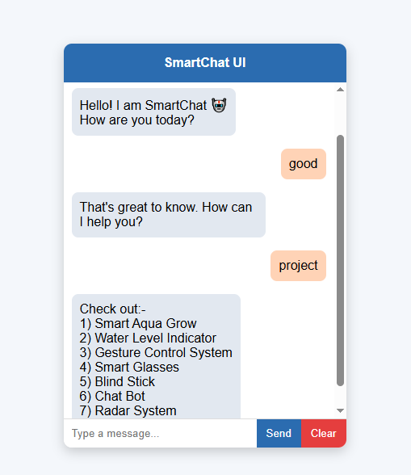

# SmartChat UI
A simple chatbot interface built using HTML, CSS, and JavaScript.

## Features
- Interactive chat UI
- Rule-based responses
- Supports multiple projects info
- Smooth user experience

## Technologies Used
- HTML
- CSS
- JavaScript

## How to Use
1. Open index.html
2. Start chatting
3. Try typing "project"

## Preview

